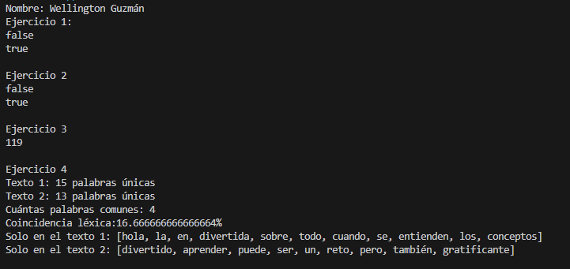

Práctica de Teoria de la complejidad
📌 Información General
Título: Sets
Asignatura: Estructura de Datos
Carrera: Computación
Estudiantes: Wellington Guzmán
Fecha: 02/07/2025
Profesor: Ing. Pablo Torres
🛠️ Descripción
Listas en distinto orden usando Sets.

🧑‍💻 Ejemplo de Salida
![Resultado de los Sets]
Nombre: Wellington Guzmán
Pedro Gonzalez - 222222222
Pablo Lopez - 222222222
Pedro Lopez - 222222222
Ana Perez - 987654321
Luis Perez - 111111111
Pedro Gonzalez - 222222222
Pablo Lopez - 222222222
Pedro Lopez - 222222222
Ana Perez - 987654321
Luis Perez - 111111111
Pedro Gonzalez - 222222222
Pablo Lopez - 222222222
Pedro Lopez - 222222222
Ana Perez - 987654321
Luis Perez - 111111111
---Ordenado por Nombre - Apellido---
Pedro Gonzalez - 222222222
Pablo Lopez - 222222222
Pedro Lopez - 222222222
Ana Perez - 987654321
Luis Perez - 111111111
---Ordenada nombre Apellido Numero - Telefono---
Pedro Gonzalez - 222222222
Pablo Lopez - 222222222
Pedro Lopez - 222222222
Ana Perez - 987654321
Luis Perez - 111111111
---Ordenada por HashCode---
Pedro Gonzalez - 222222222
Pablo Lopez - 222222222
Pedro Lopez - 222222222
Ana Perez - 987654321
Luis Perez - 111111111

Ejercicios con SET
